+++
title = "East Africa Flavor Pack"
description = "A detailed East African religious and historical expansion module."
+++

## Overview

The East Africa Pack expands religious mechanics and historical flavor across the Horn of Africa and surrounding regions.

## Features

- New Coffee Plantation Building
- Coffee Wars
- Unique Decisions
- Historical Muslim Sects

## Screenshots

  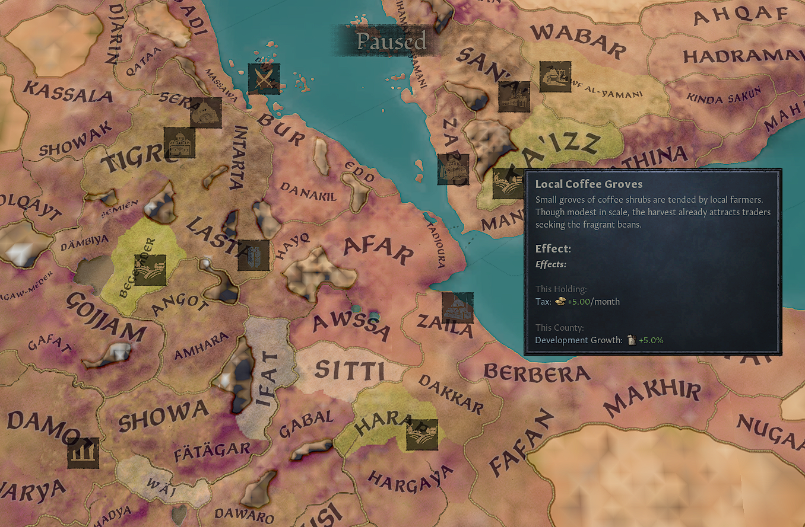
  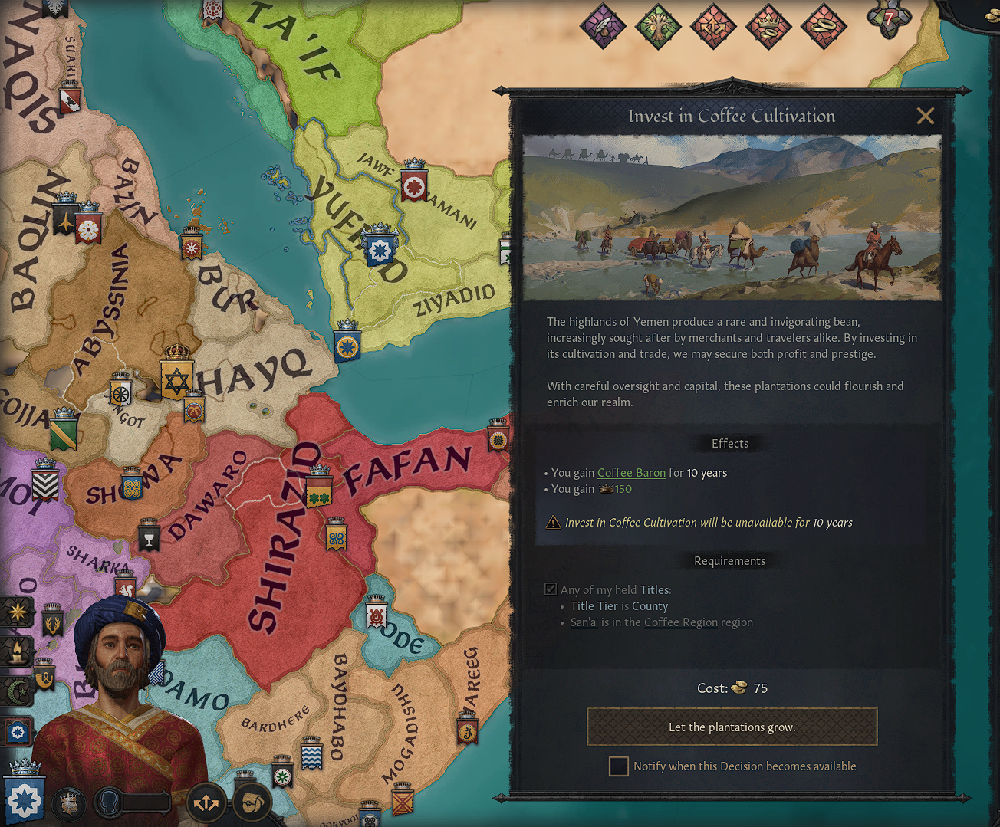
  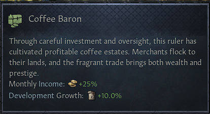
  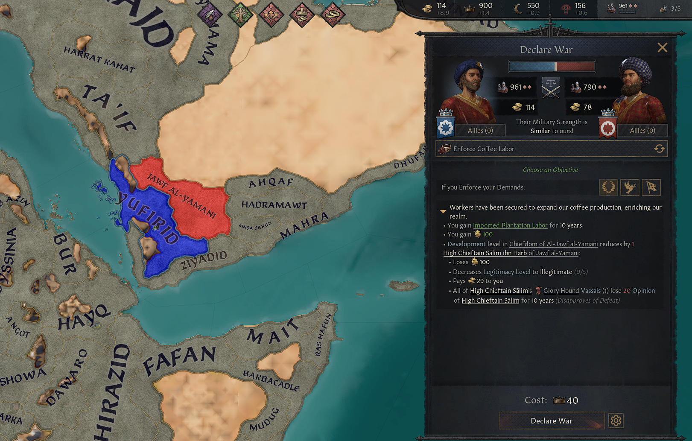
  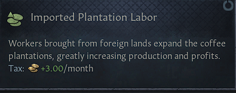
  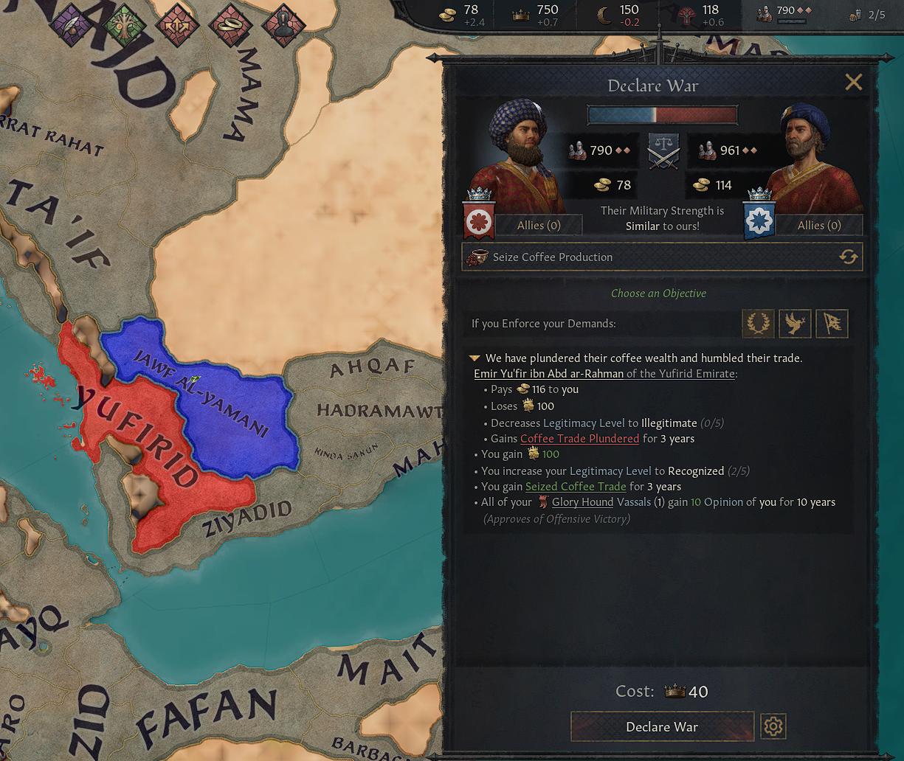
  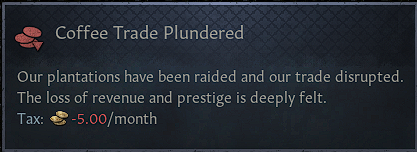
  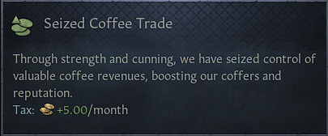
  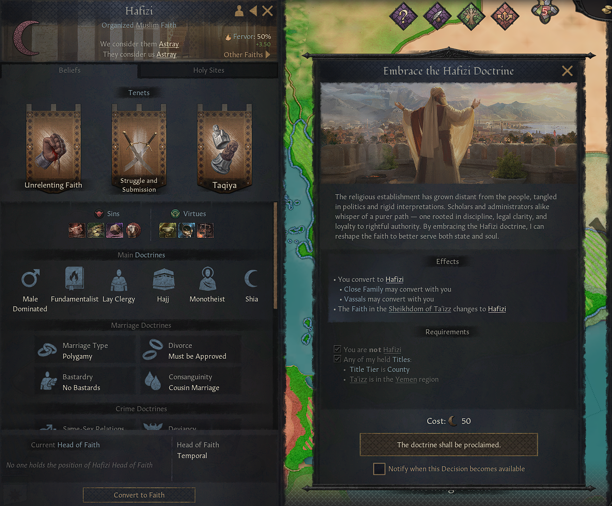
  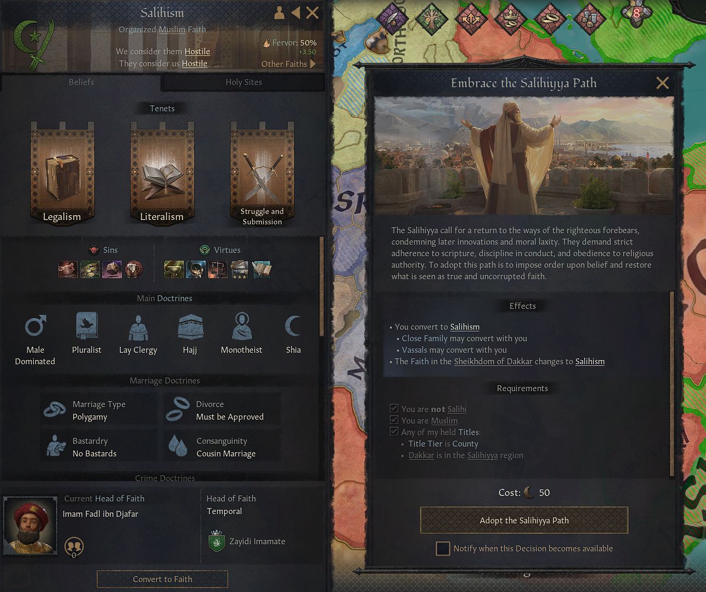
  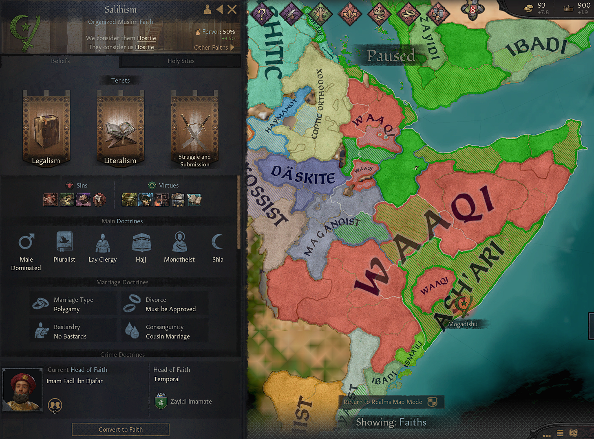
  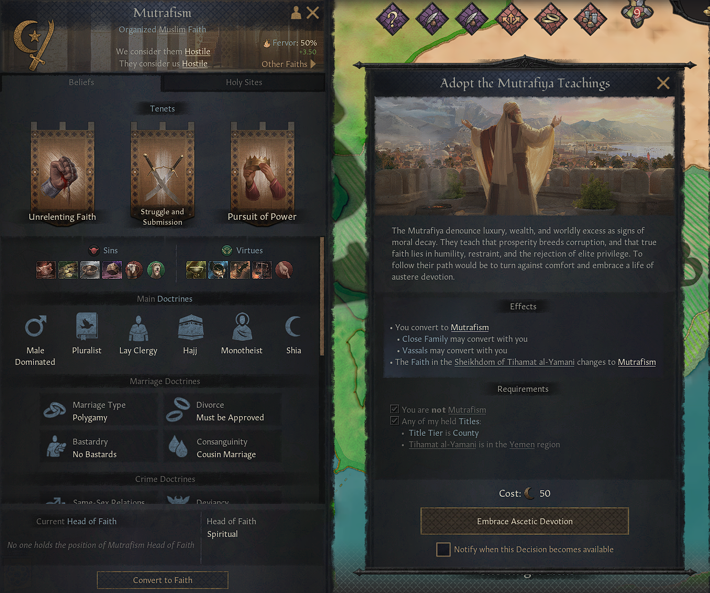

  

