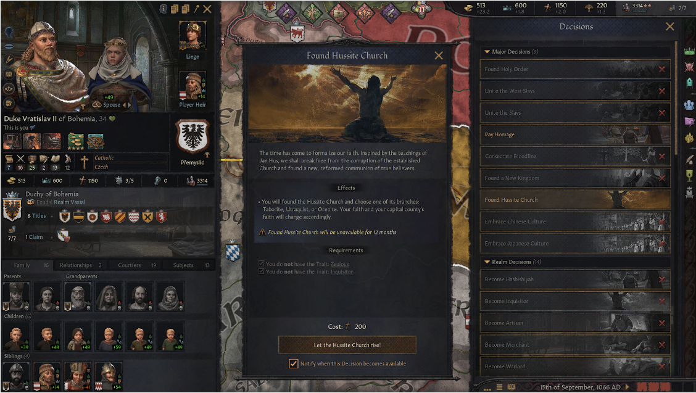
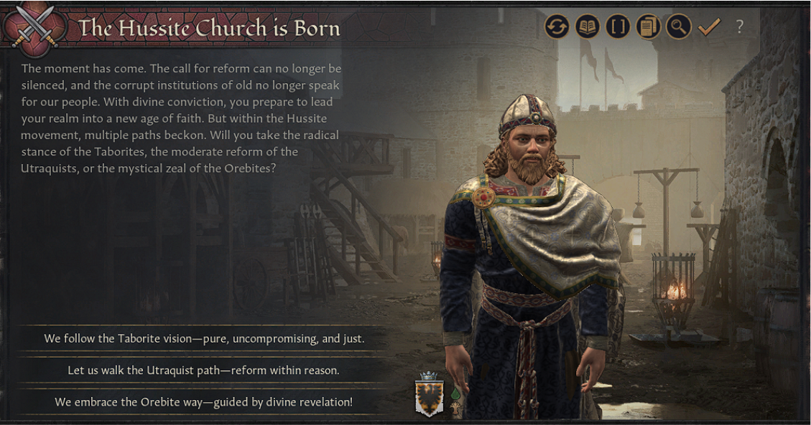
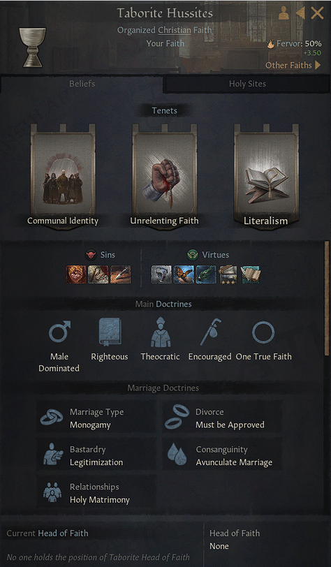
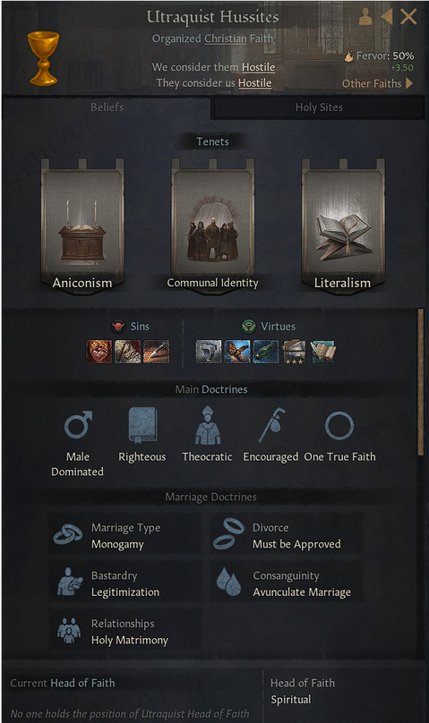
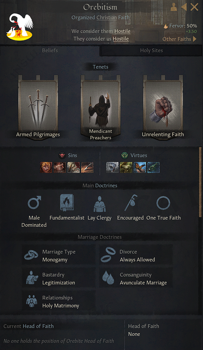
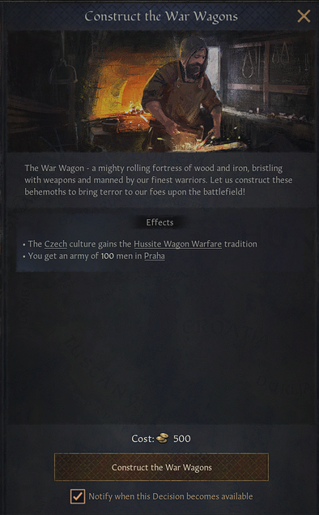
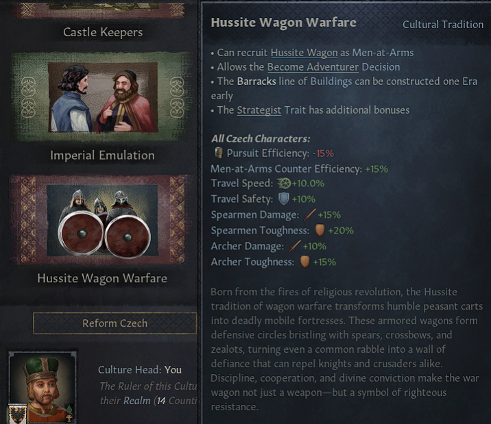
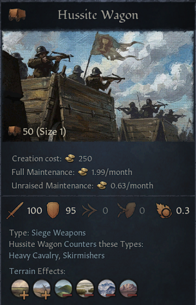

+++
title = "Hussite Flavor Pack"
description = "A detailed Hussite religious and historical expansion module."
+++

## Overview

The Hussite Flavor Pack expands religious mechanics and historical flavor surrounding the Hussite movement in Bohemia.

## Features

- Found the Hussite Church decision
- Unique religious events
- Theological paths
- New Cultural Tradition
- Historical Man-at-Arms

## Screenshots

  
  
  
  
  
  
  
  

  

